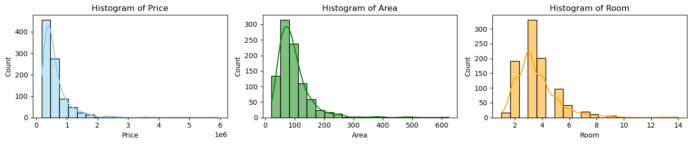
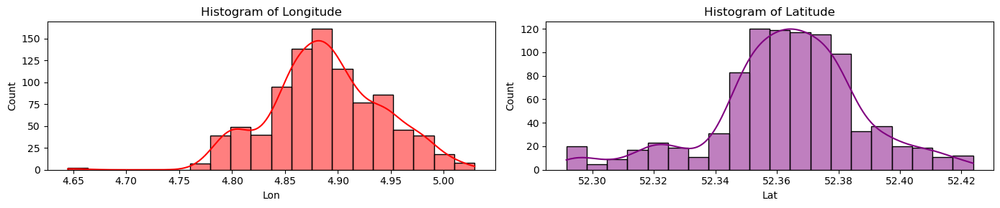
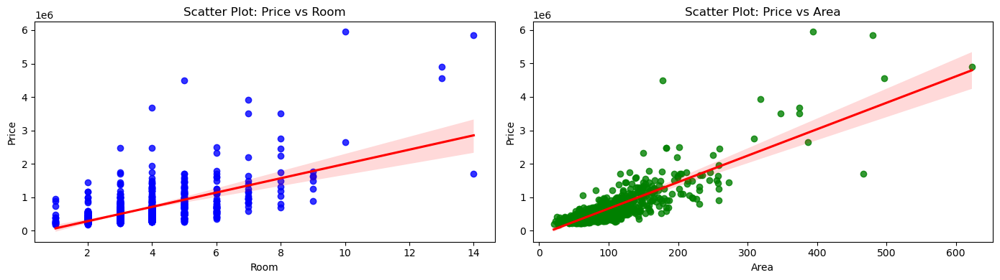
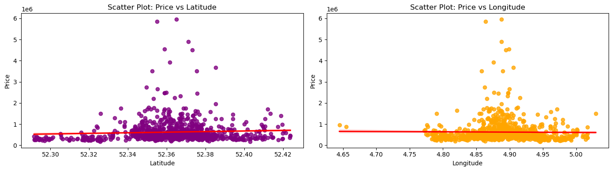
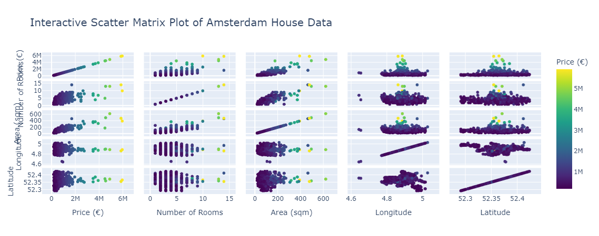
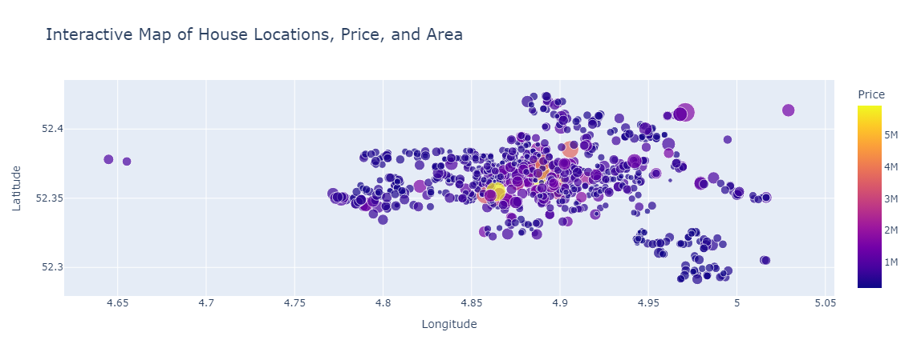
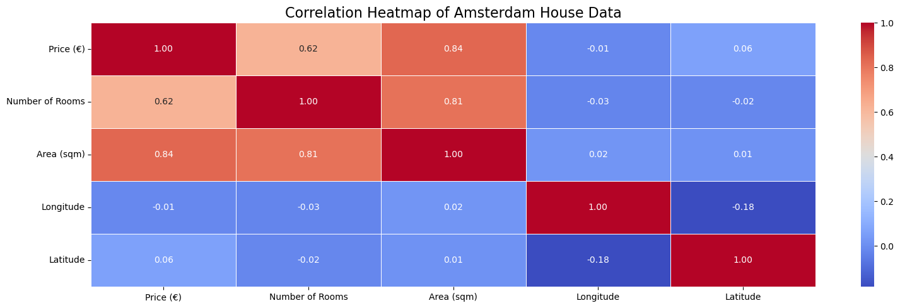
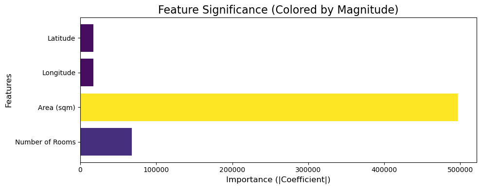
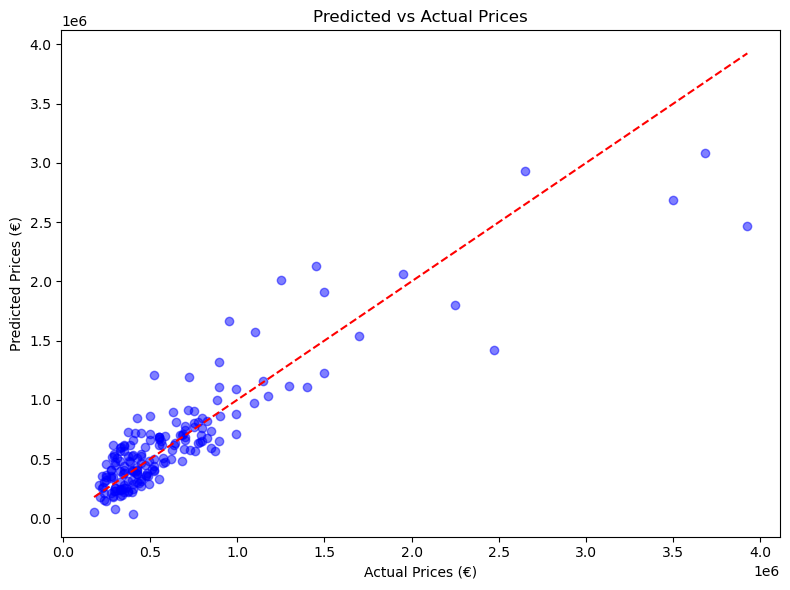

---

🚀 Experience the **Amsterdam Housing Price Prediction App** in action:  
👉 [**Check it out here!**](#)  

🏠 Predict housing prices in Amsterdam using advanced Machine Learning models.  
💻 Explore the power of data-driven insights in real estate and market trends.

---

# From Data to Dwelling: Decoding Amsterdam's Housing Prices 

## Abstract
This project aims to analyze and predict **housing prices in Amsterdam** using data from August 2021. The primary goal is to **identify trends affecting housing prices**. By analyzing predictors such as property area, number of rooms, and geographic location, the project will explore relationships through exploratory data analysis (EDA). A predictive model, using Simple regression, will be developed to estimate prices and provide insights into the market.
 
 
## Exploratory Data Analysis with Visualisation

### Figure 01. Histogram of (a) Price, (b) Area of House and (c) number of rooms

### Figure 02. Histogram of (a) Longitude, (b) Latitude

### Figure 03. (a) Rooms vs Price , (b) Area vs Price 

### Figure 04. (a) Price vs Latitude, (b) Price vs Longitude 

### Figure 05. Scatter Plots betweem features

### Figure 06. Plot of Price vs Longitude and Latitude coloured by Area

### Figure 07. HeatMap Correlation Plot

## Significance of features for prediction
### Figure 08. Feature Significance for model

## Evaluation for predicting model
- **Mean Absolute Error (MAE)**: 164,755.89
- **Mean Squared Error (MSE)**: 60,958,225,226.29
- **R-squared (R²)**: 0.80

### Figure 09. Plot of Predicted Price vs Original price

